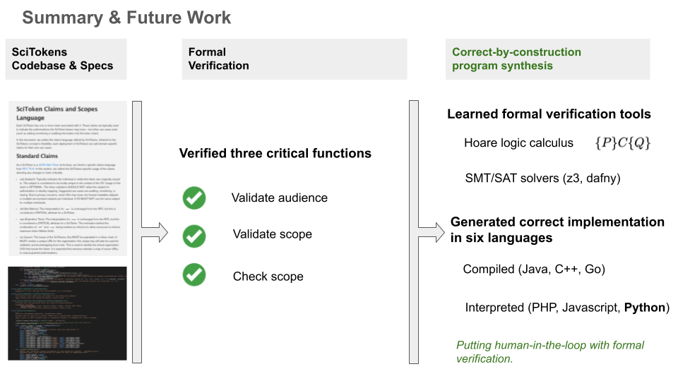

# Formal Verification in SciTokens
Name: Bach Hoang (bachh2@illinois.edu)

Mentors: Jim Basney (jbasney@illinois.edu) and Phuong Cao (pcao3@illinois.edu)

This is the final project of what I do in SciAuth Students Fellow Program (https://sciauth.org/fellows/). 

Link: https://sciauth.org/fellows/Bach_Hoang_final_presentation.pdf 
